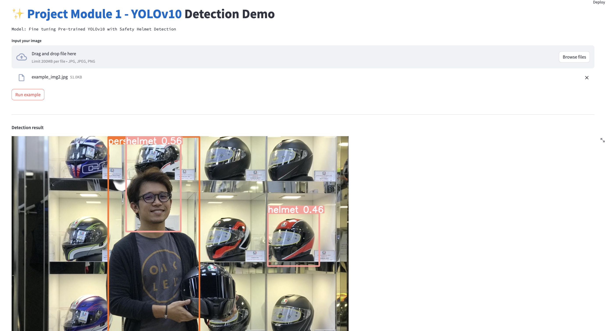

# Helmet Safety Detection with YOLOv10 and Streamlit

Đây là ứng dụng sử dụng mô hình YOLOv10 để phát hiện việc đội mũ bảo hộ. Ứng dụng được triển khai bằng Streamlit. Dự án này được lấy từ kho mã nguồn:
- [YOLOv10](https://github.com/THU-MIG/yolov10/)
- [YOLOv10_Streamlit_Demo](https://github.com/wjnwjn59/YOLOv10_Streamlit_Demo).

Repo này cũng chứa mã nguồn của dự án Label Image, một công cụ để gán nhãn dữ liệu
- [Label Image](https://github.com/HumanSignal/labelImg)

## Mục Lục

1. [Giới thiệu](#giới-thiệu)
2. [Yêu cầu](#yêu-cầu)
3. [Cài đặt](#cài-đặt)
4. [Chạy ứng dụng](#chạy-ứng-dụng)
5. [Sử dụng ứng dụng](#sử-dụng-ứng-dụng)
6. [Tài liệu tham khảo](#tài-liệu-tham-khảo)

## Giới thiệu

Ứng dụng này sử dụng mô hình YOLOv10 để phát hiện người đội mũ bảo hộ trong các hình ảnh. Ứng dụng được triển khai bằng Streamlit để tạo giao diện người dùng trực quan và dễ sử dụng.

## Yêu cầu

Để chạy ứng dụng này, bạn cần cài đặt các thư viện và công cụ sau:

- Python 3.10 (để cài được torch 2.0.1 do module models/yolo_v10 yêu cầu )
- Git
- Streamlit  
- Pytest & Pytest coverage
- Coverage
- models/yolo_v10/.
  * PyTorch
  * huggingface-hub
  * Opencv-python
  * ...

## Notebooks

vì train fine-tuning cho pre-trained model Yolov10 với data safety Helmet cần GPU nên phần này được run trên Colab
- YOLO v10 fine tuning using Helmet Safety Detection Dataset [](https://colab.research.google.com/drive/1VskXvvN4A5aQ-H8GqCcu8kmGnMriAU_K?usp=sharing)
- YOLO v10 pre-trained inference [](https://colab.research.google.com/drive/16h6HfIZhQQA5rrdUrkNorEJwA9SYKoAX?usp=sharing)


## Cài đặt

1. **Clone kho mã nguồn từ GitHub:**

    ```bash
    git clone https://github.com/AIO-441-nguyen-thi-kim-tuyen/yoloV10.git
    cd yoloV10
    ```

2. **Tạo môi trường ảo (tuỳ chọn nhưng được khuyến khích):**

    ```bash
    python -m venv venv
    source venv/bin/activate  # Trên Unix hoặc MacOS
    .\venv\Scripts\activate   # Trên Windows
    ```

3. **Cài đặt các thư viện cần thiết:**

    ```bash
       pip install -r requirements.txt
    ```
4. **Đường dẫn thư mục chứa model được cấu hình trong ```config/model_config.py```**
    
    ```python
    class Detector_Config:
        weight_path: str = 'models/yolo_v10/weights/best.pt'
    ```
    
## Chạy ứng dụng

1. **Khởi động ứng dụng Streamlit:**

    ```bash
    streamlit run safety_helmet_detection_app.py
    ```

    Ứng dụng sẽ tự động mở trong trình duyệt web mặc định của bạn tại địa chỉ `http://localhost:8501`.

## Sử dụng ứng dụng

1. **Tải ảnh lên:**

    Nhấn vào nút "Browse files" để tải lên ảnh mà bạn muốn kiểm tra.

2. **Chạy file ảnh ví dụ**
    Nhấn vào nút "Run example", ứng dụng sẽ tự động phát hiện và hiển thị các vùng chứa người đội mũ bảo hộ trong ảnh ví dụ của chương trình.

4. **Phát hiện mũ bảo hộ:**

    Ứng dụng sẽ tự động phát hiện và hiển thị các vùng chứa người đội mũ bảo hộ trong ảnh đã tải lên. Kết quả sẽ được hiển thị trực tiếp trên ảnh.

[]

## Sonar Cloud 
### Sonar Cloud Project
[Link to Sonar Cloud](https://sonarcloud.io/project/configuration?id=AIO-441-nguyen-thi-kim-tuyen_yoloV10)

[New code Summaty]((https://sonarcloud.io/summary/new_code?id=AIO-441-nguyen-thi-kim-tuyen_yoloV10))
### SonarCloud Status

[Quality Gate Status](https://sonarcloud.io/api/project_badges/measure?project=AIO-441-nguyen-thi-kim-tuyen_yoloV10&metric=alert_status)

[Alert Status](https://sonarcloud.io/api/project_badges/measure?project=AIO-441-nguyen-thi-kim-tuyen_yoloV10&metric=alert_status)

## Tài liệu tham khảo

- [YOLOv10_Streamlit_Demo trên GitHub](https://github.com/wjnwjn59/YOLOv10_Streamlit_Demo)
- [Streamlit Documentation](https://docs.streamlit.io/)
- [YOLO: Real-Time Object Detection](https://pjreddie.com/darknet/yolo/)
- [YOLOv10_Streamlit_Demo](https://github.com/wjnwjn59/YOLOv10_Streamlit_Demo)

